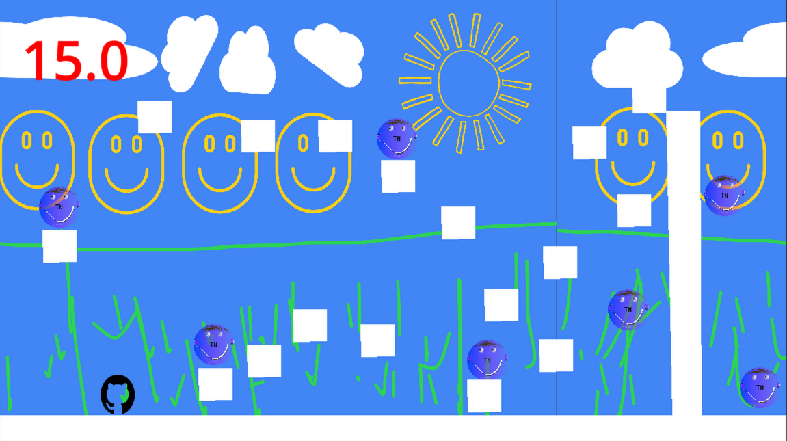
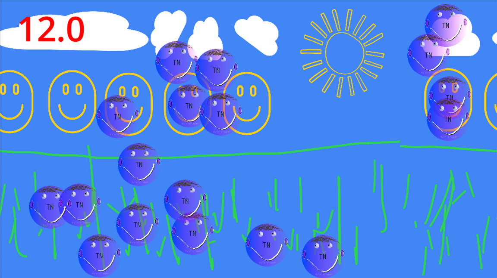

# CodeWare

CodeWare is a WarioWare-style video game where you have to complete various minigames, written in Godot. Do as good as you can—time is tight.

**5 lives, 5 chances.**

---

## How to Play

* **Objective:** Instruction prompts coming soon, complete the minigame objective, and definitely don't run out of time.
* **Controls:**
    * **Movement:** Arrow Keys & Spacebar
    * **Action / Aim:** Mouse Cursor + Left Click
    * **Restart / Pause:** COMING SOON: `Esc` / `R`

---

## Minigames

### Minigame 1: Platformer

In minigame 1, you have 25 seconds to collect 7 tyleruploads orbs. Each orb has a diameter of 60 pixels.



### Minigame 2: Clicker

In minigame 2, you have 12 seconds to click 18 tyleruploads circles. Each pixel has a diameter of 50 pixels.



## Running the Game

### For Players

THIS METHOD IS COMING SOON

1. Go to the [Releases](https://github.com/tyleruploads/code-ware/releases) tab.
2. Download the executable build for your operating system, or download the webpage.
3. Launch `CodeWare` or the webpage and start playing!

## For Developers / Contributors:

1. Clone this repository:
    ```bash
    git clone https://github.com/tyleruploads/code-ware.git
    ```
2. Open Godot 4.x (Written in version 4.7.2).
3. Import the project with `/src/project.gotot` file.
4. Start the game by pressing `F5`.

## Security

For information on reporting security vulnerabilities, see [SECURITY.md](SECURITY.md)

## License

See [LICENSE.md](LICENSE.md) for licensing information.
