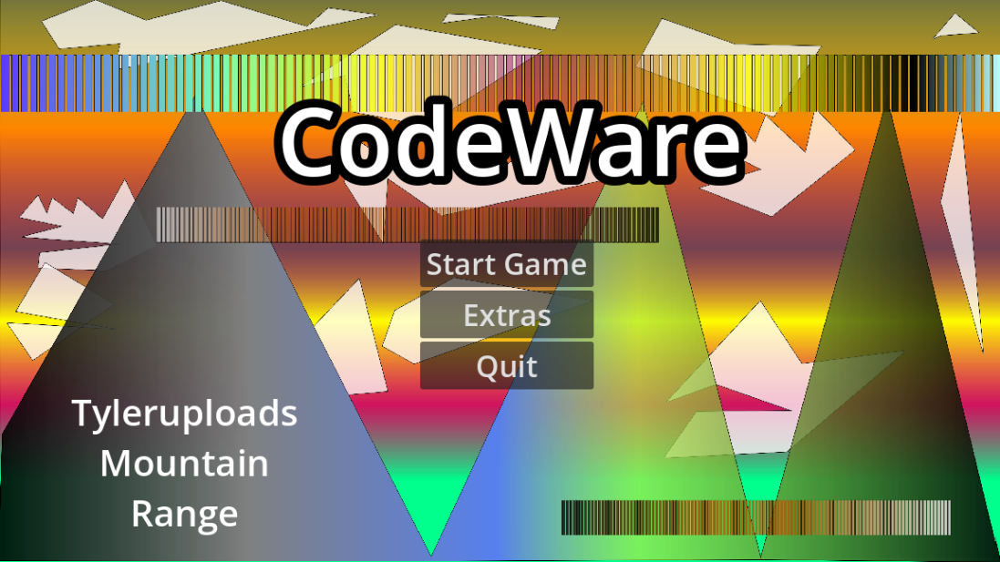
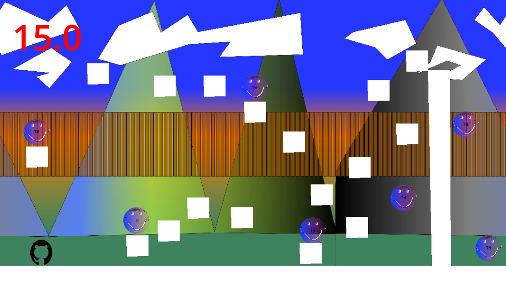
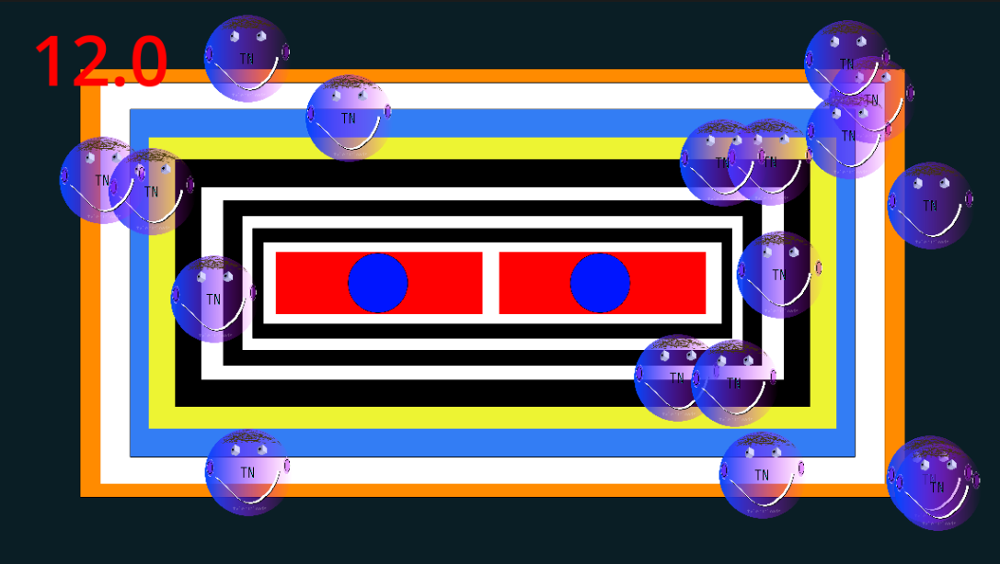
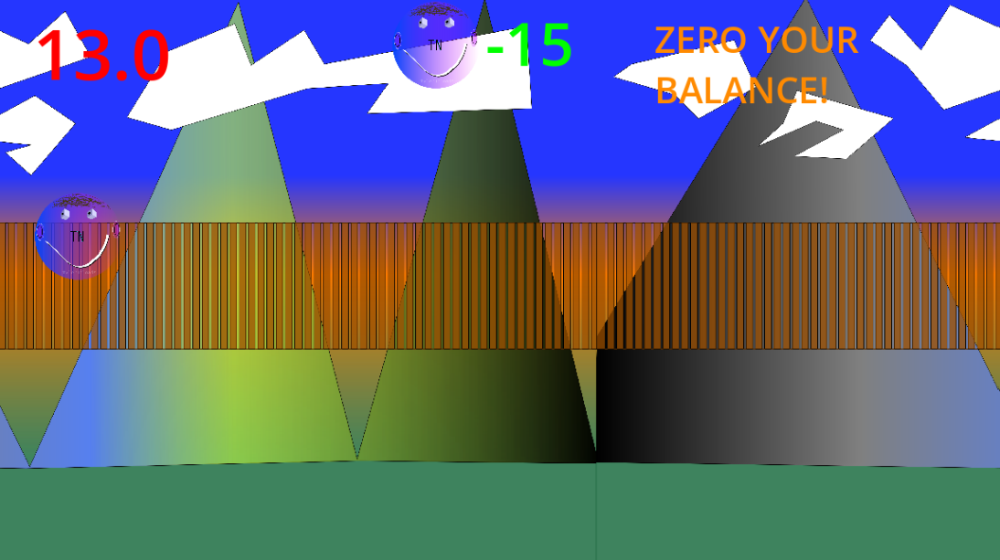
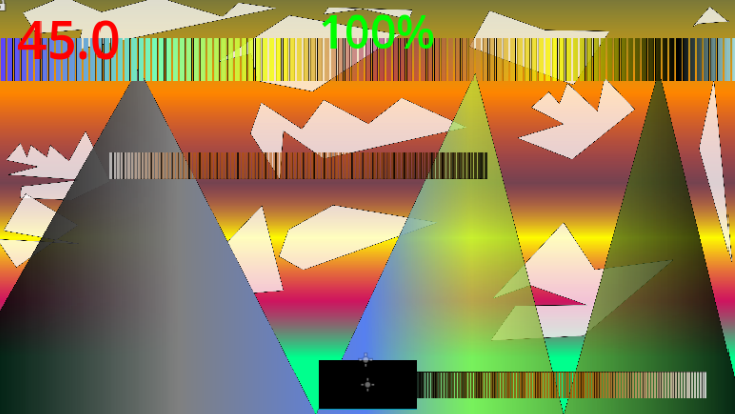
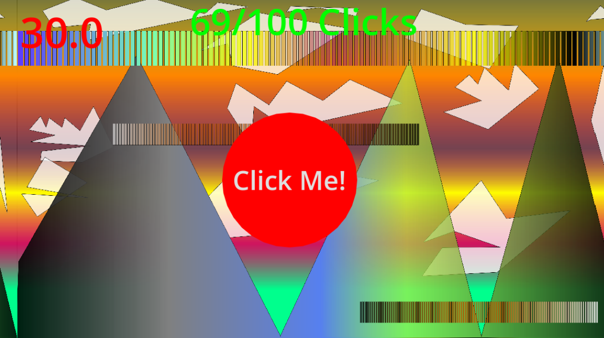
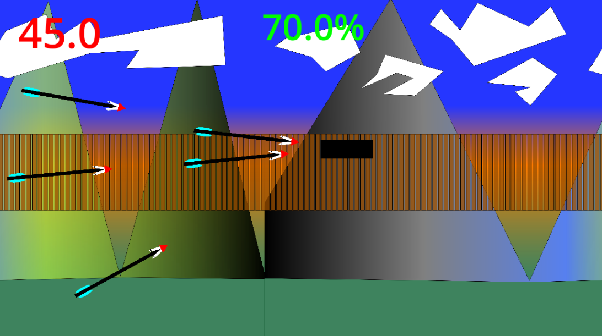

# CodeWare

CodeWare is a WarioWare-style video game where you have to complete various minigames, written in Godot. Do as good as you can, time is tight.

**5 lives, 5 chances.**

---



---

## How to Play

* **Objective:** Complete the minigame objective in the given time frame.
* **Controls:**
    * **Movement:** WASD, Arrow Keys, and Spacebar
    * **Action / Aim:** Mouse Cursor + Left Click
    * **Pause / Unpause:** Esc
    * **Restart Current Scene:** R

---

## Minigames

### Minigame 1: Orb Collection Platformer

In minigame 1, "Orb Collection Platformer," you have 25 seconds to collect 7 tyleruploads orbs. Each orb has a diameter of 60 pixels.



### Minigame 2: Orb Collection Clicker

In minigame 2, "Orb Collection Clicker," you have 12 seconds to click 18 tyleruploads circles. Each pixel has a diameter of 50 pixels.



### Minigame 3: Hit the Circles

In minigame 3, you have 17 seconds to zero your balance of circles by clicking on any circle whenever you see it pop up!



### Minigame 4: Dodge the Flying Balls

In minigame 4, "Dodge the Flying Balls," you have 45 seconds to dodge the flying balls by moving left and right. Each hit takes away 10% health.



## Minigame 5: Click Very Fast

In minigame 5, "Click Very Fast," you have 20 seconds to click a button on the center of the screen 100 times.



## Minigame 6: Unintelligent Arrows

In minigame 6, "Unintelligent Arrows," you have 45 seconds to dodge a bunch of unintelligent arrows! The reason for their unintellectuality is their inability to change direction once they are fired. Don't stay near the edges, or you won't have much time to react!



## Running the Game

### For Players

#### Website

> This method is coming soon

#### Manual Installation

1. Go to the [Releases](https://github.com/tyleruploads/code-ware/releases) tab.
2. Download the executable build for your operating system, or download the webpage.
3. Launch `CodeWare` or the webpage and start playing!

> If you are using the manual web option, you must start a local web server. I personally use `python3 -m http.server 8000`, which will make a web server hosting the site exposed on port 8000.

## For Developers / Contributors:

1. Clone this repository:
    ```bash
    git clone https://github.com/tyleruploads/code-ware.git
    ```
2. Open Godot 4.x (Written in version 4.7.2).
3. Import the project with `/src/project.gotot` file.
4. Start the game by pressing `F5`.

## Security

For information on reporting security vulnerabilities, see [SECURITY.md](SECURITY.md)

## License

See [LICENSE.md](LICENSE.md) for licensing information.
