# CodeWare

CodeWare is a WarioWare-style video game where you have to complete various minigames, written in Godot. Do as good as you can, time is tight.

**5 lives, 5 chances.**

[](https://tyleruploads.itch.io/codeware)
[](https://tyleruploads.github.io/code-ware/)
[](https://godotengine.org)


---

<div align="center">
    <h3>Watch Gameplay Video</h3>
    <a href="https://www.youtube.com/watch?v=Sfma8rk4A2g" target="_blank">
        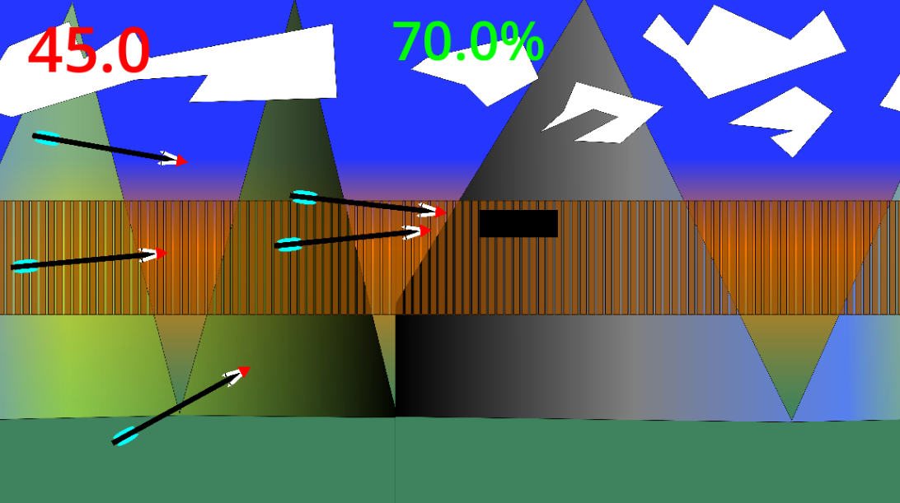
    </a>
</div>

---

## How to Play

* **Objective:** Complete the minigame objective in the given time frame.
* **Controls:**
    * **Movement:** WASD, Arrow Keys, and Spacebar
    * **Action / Aim:** Mouse Cursor + Left Click
    * **Pause / Unpause:** Esc
    * **Restart Current Scene:** R

---

## Running the Game

### For Players

#### Website

You can play CodeWare on either of the following sites.

* **Itch\.io:** [https://tyleruploads.itch.io/codeware](https://tyleruploads.itch.io/codeware)
* **GitHub Pages:** [https://tyleruploads.github.io/code-ware/](https://tyleruploads.github.io/code-ware/)

#### Manual Installation

1. Go to the [Releases](https://github.com/tyleruploads/code-ware/releases) tab.
2. Download the executable build for your operating system, or download the webpage.
3. Launch `CodeWare` or the webpage and start playing!

> **Web Builds Notice:** If running web build locally, you must start a local HTTP server (e.g., `python3 -m http.server 8000`).

## For Developers / Contributors:

1. Clone this repository:
    ```bash
    git clone https://github.com/tyleruploads/code-ware.git
    ```
2. Open Godot 4.x (Written in version 4.7.2)
3. Import the project with `/src/project.godot` file
4. Start the game by pressing `F5`

---

## Minigames

> **Warning:** The section below contains full descriptions and images of every minigame

<details>
<summary>Click to reveal all minigame overviews and images</summary>


### Minigame 1: Orb Collection Platformer

In minigame 1, "Orb Collection Platformer," you have 25 seconds to collect 7 orbs.

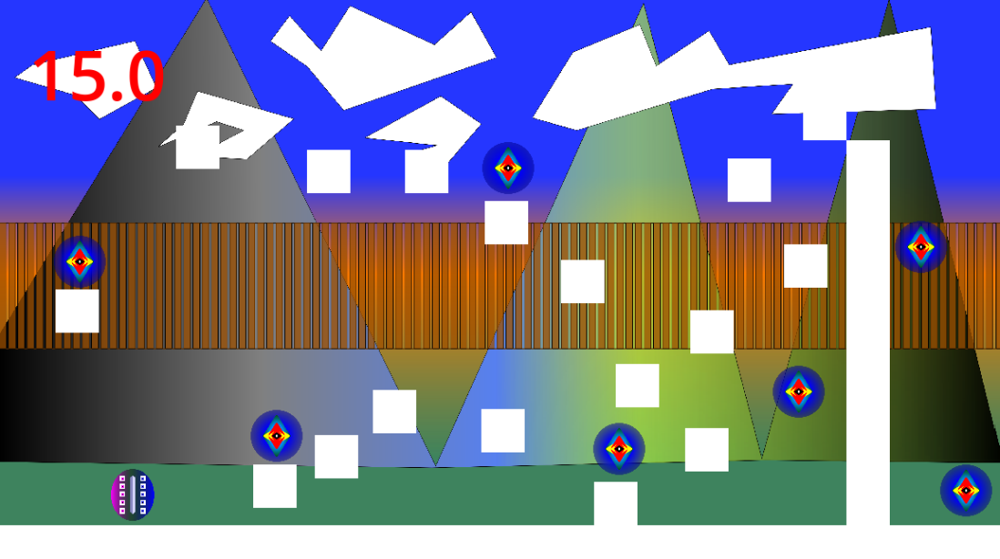

### Minigame 2: Orb Collection Clicker

In minigame 2, "Orb Collection Clicker," you have 12 seconds to click on 18 orbs.

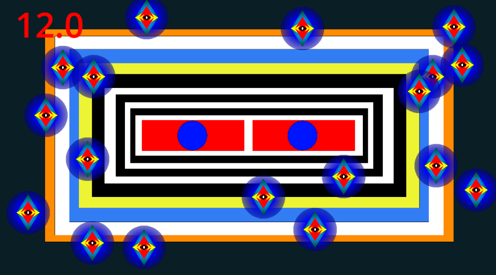

### Minigame 3: Hit the Orbs

In minigame 3, you have 17 seconds to zero your balance of orbs by hitting any orb whenever you see it pop up!

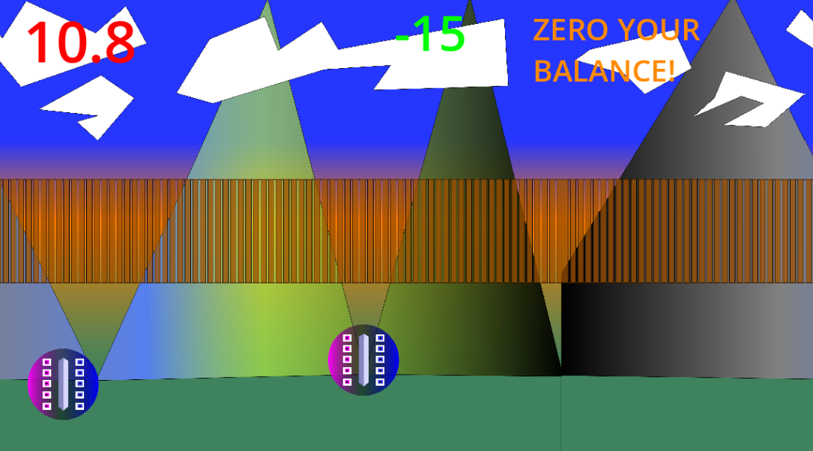

### Minigame 4: Dodge the Flying Balls

In minigame 4, "Dodge the Flying Balls," you have 45 seconds to dodge the flying balls by moving left and right. Each hit takes away 10% health.

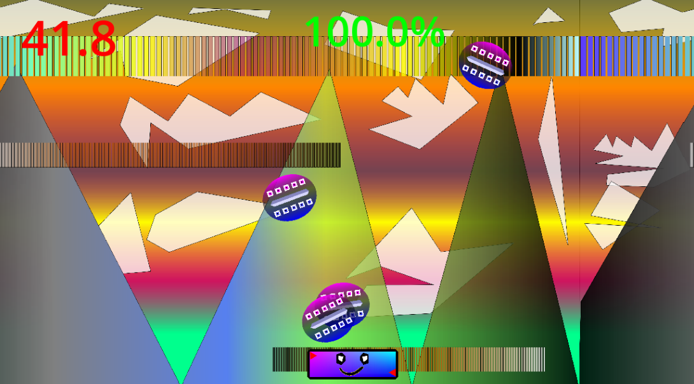

### Minigame 5: Click Very Fast

In minigame 5, "Click Very Fast," you have 20 seconds to click a button on the center of the screen 100 times.

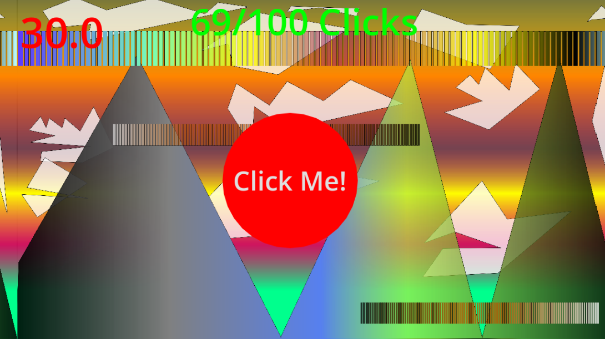

### Minigame 6: Unintelligent Arrows

In minigame 6, "Unintelligent Arrows," you have 45 seconds to dodge a bunch of unintelligent arrows! The reason for their unintellectuality is their inability to change direction once they are fired. Don't stay near the edges, or you won't have much time to react!


### Minigame 7: Pick the Lock

In minigame 7, "Pick the Lock," you have 10 seconds to pick the lock four times by pressing the spacebar once the slider reaches the green zone in the middle!

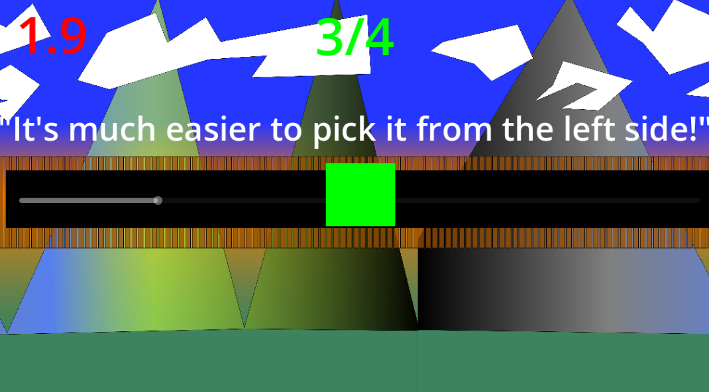

### Minigame 8: Choose the Boxes

In minigame 8, "Choose the Boxes," you have 30 seconds to match 20 boxes. When the color of the box in the center changes, click the box on the bottom that has its color!

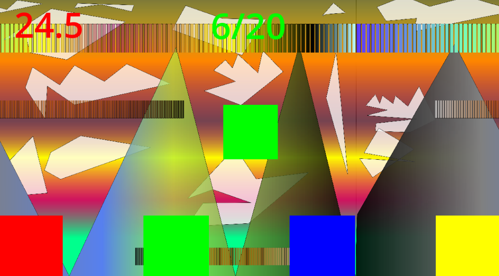

### Minigame 9: The Maze

In minigame 9, "The Maze," you have 18 seconds to get to the center of the maze. It's pretty self explanatory. Don't think too hard, or you'll run out of time!

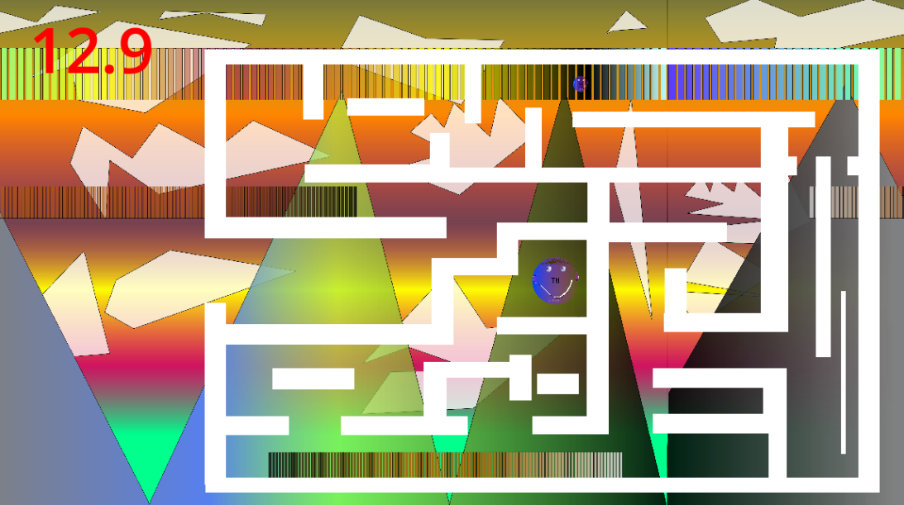

### Minigame 10: RGB Skills

In minigame 10, "RGB Skills," you have one minute to match two colors with at least 80% accuracy. The color on the right is controlled with RGB sliders near the bottom of the screen.

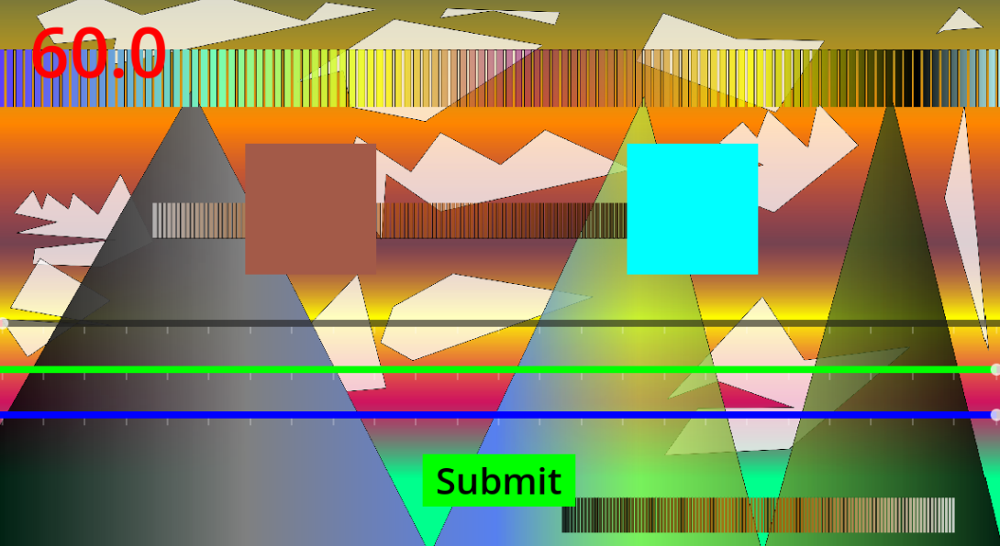

### Minigame 11: Type the Strings

In minigame 11, "Type the Strings," you have one minute to type 15 5-character strings! The text is auto-submitted once its length is correct.

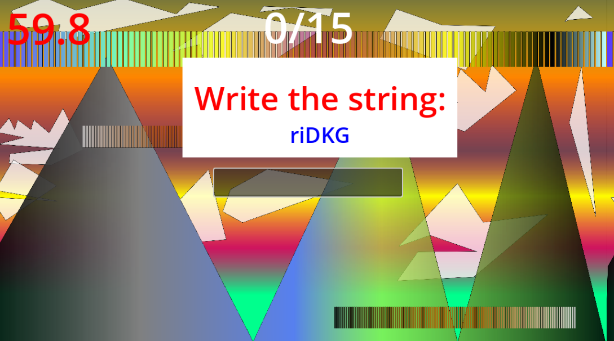

### Minigame 12: Catch the Falling Orbs

In minigame 12, "Catch the Falling Orbs," you have 45 seconds to capture 35 falling orbs. In order to collect an orb, you need to position yourself in the correct horizontal position so the orb will hit you.

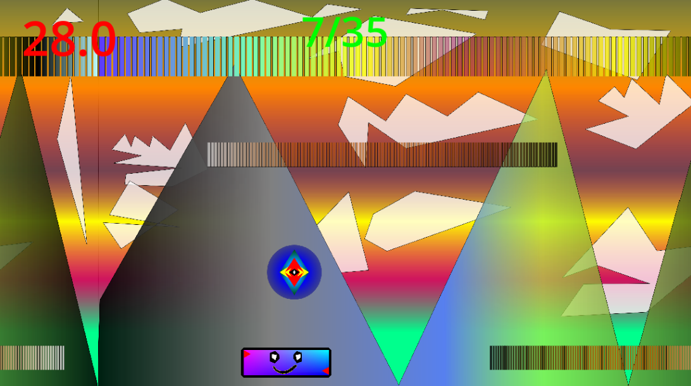
</details>

---

## Security

For information on reporting security vulnerabilities, see [SECURITY.md](SECURITY.md)

---

## License

See [LICENSE.md](LICENSE.md) for licensing information.
